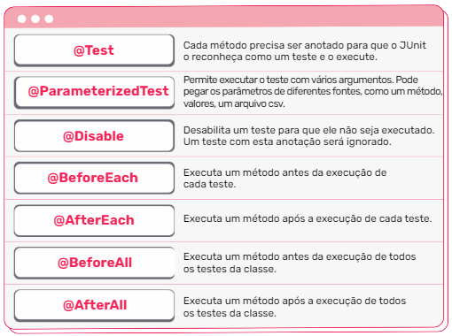
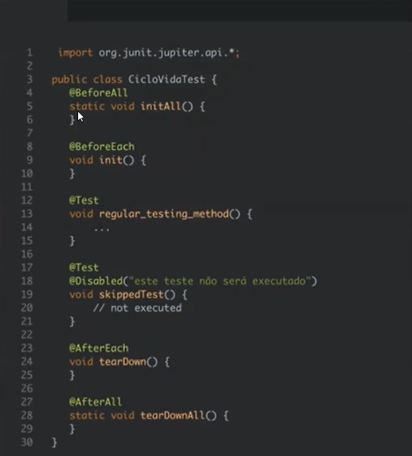
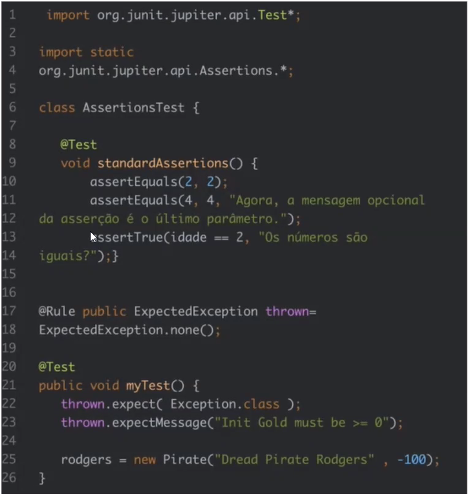

    Aula 1

## O que é Backend?

Backend é a parte que o usuário não tem contato direto da aplicação, mas nele estão programadas a lógica de programação e as regras de negócio. Quando um texto está sendo exibido na tela ou quando alguma ação está sendo executada, significa que o backend está funcionando corretamente.

Importante que ao desenvolver uma aplicação, sempre buscar ter o olhar do usuário.

## Introdução ao teste unitário e de integração

No mundo da programação você não é o único a mexer na sua aplicação, no seu código, por isso a importancia de se fazer comentários e testes para verificar bugs ou mal funcionamentos antes dele ser disponibilizado à outras pessoas.

### Testes de integração

- O teste de integração é feito para saber se as partes ao estarem integradas, irão funcionar bem.

### Testes unitários 
- O teste unitário é a menor parte de um teste
- No teste unitário é possível testar cada método do código separadamente

|Vantagens|Descrição|
|-|-|
|Facilitar as mudanças de código |Ao decectar  o erro rapidamente, é mais fácil alterá-lo e testá-lo novamente.|
|Fornecem documentação |Ajudam a entender o que o código faz e qual era a intenção ao desenvolvê-lo|
|Encontra bugs |Testando componentes individuais antes da integração. Isso garante que eles não afetem outra parte do código.|
|Melhoram o design e a qualidade do código |Convidam o desenvolvedor a pensar sobre o design antes de escrevê-lo (Test Driven Development - TDD)|

##### Os comandos abaixo são referentes aos testes unitários.

##### Teste unitário no código

>> Obs.:@PalavraReservada é una anotação e muda o comportamento natural de um método.

### Validação dos testes

- O assert é que verifica de fato os testes

`assertEquals(2, 2);` No primeiro coloca a chamada do teste, que é o que tá esperando do método, no segundo é o que é esperado que o método retorne.
`assertTrue(idade == 2, "os números são iguais?")` O assertTrue não valida e não compara, ele valida a comparação

