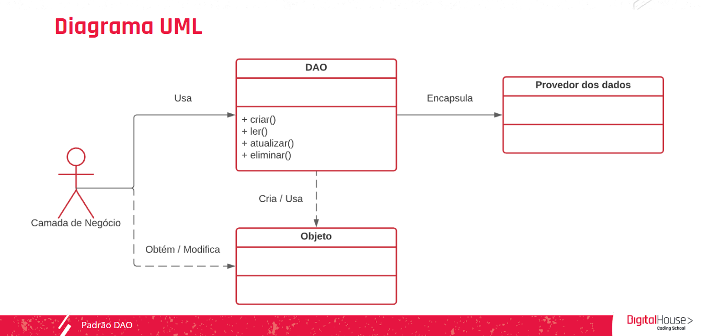

    Aula 11

# Padrão DAO

Em formas gerais o padrão DAO serve pra organizar melhor o projeto, possibilitando que cada coisa cuide do que precisa cuidar

### Propósito

Com o padrão DAO, separamos os dados propriamente ditos do local onde são armazenados ou tecnologia de armazenamento. Ou seja, para o nosso sistema, será indiferente se utilizarmos PostgreSQL ou MySQL, pois em ambos os casos a forma de comunicação será a mesma.

### Solução

Este padrão propõe:
1. Criar uma interface na qual definimos todas as operações que queremos realizar. Geralmente, as mais utilizadas são criar, atualizar, deletar e ler;
2. Criar as diferentes implementações dessa interface. Por exemplo: uma implementação para PostgreSQL e outra para MySQL.

Desta forma, a camada de negócio, ou seja, onde encontramos a lógica principal do nosso sistema, se comunicará com a camada de persistência, mas não saberá os detalhes da implementação, se estamos usando PostgreSQL ou MySQL, pois teremos os mesmos métodos da interface.

Quando falamos em **“Camadas”**, o que queremos dizer?
Em um sistema, chamamos de “camada” o agrupamento de componentes (classes) com responsabilidades iguais.

####Diagrama do padrão DAO

### Conclusão
>O padrão DAO nos permite abstrair a lógica de negócio de nossa camada de persistência, tornando o sistema muito mais fácil de evoluir.