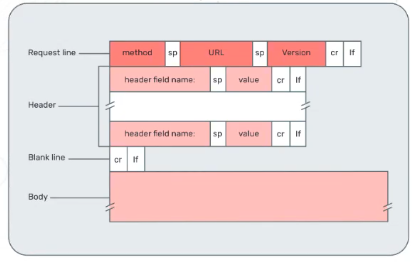
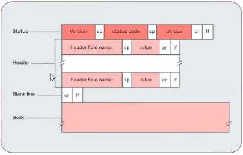
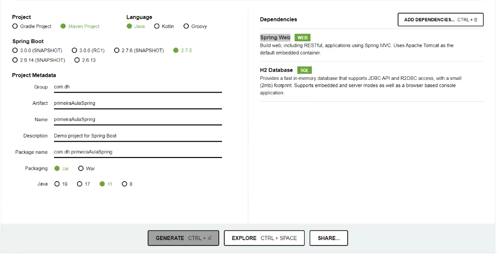

    Aula 16

## Spring boot
Tudo que foi feito antes daqui, é o que o spring boot faz, porém por debaixo dos panos.
Ele é um serviço que trafega informações pela rede.
Quando o cliente faz um pedido, ele faz um *request*, quando o servidor entrega, ele faz um *response*.

#### Como são os formatos?
##### **Request**
**Method:** indica qual método está sendo usado para enviar a mensagem; - (como vai fazer o pedido)
**URL:** endereço para onde o pedido está sendo enviado; - (telefone do pedido)
**Header(cabeçalho):** atributos gerais ou essenciais incluídos. Por exemplo, Auth; - (qual é o pedido)
**Body:** corpo da mensagem utilizada nas solicitações de transmissão de dados. - (sabores e detalhes do pedido)

##### **Response**
O status é um código que representa o que acontece com uma solicitação. Existem diferentes códigos de status, sendo:
**1xx:** Respostas informativas indicando que a solicitação foi recebida e está sendo processada;
**2xx:** Respostas de sucesso, indicam que a solicitação foi processada corretamente, por exemplo: 200 Success;
**3xx:** Respostas de redirecionamento;
**4xx:** Erros causados pelo cliente, por exemplo: 404 Not Found;
**5xx:** Erros causados pelo servidor, por exemplo: 500 Internal Server Error.
- header (cabeçalho) contém atributos gerais ou essenciais;
- body (corpo) corresponde à resposta da mensagem.

#### **Framework ou biblioteca?**

As diferenças entre elas são as seguintes:
Biblioteca é um código pronto que pegamos e implementamos no código, como o h2 e o log4j
Framework é uma fôrma que a gente precisa se moldar pra usar, como o spring boot, pois se não desenvolvermos no padrão dele, ele não funciona.
Ou seja, a biblioteca a gente usa, o framework a gente tem que se adaptar pra usar senão, não funciona.

#### O que faz o Spring?
Spring é framework de código aberto para criação de aplicações em Java
A arquitetura é modular e possui flexibilidade para implementar diferentes tipos de arquiteturas, de acordo com a necessidade da aplicação, por exemplo, o módulo de gerenciamento de banco de dados, permite que configuremos e façamos queryes de um modo muito mais simples.

O Sprint Boot é uma extenção, ou seja, um pacote pré configurado para rodar o spring usando as melhores práticas sem perder a flexibilidade.

Exemplo da vida real: Spring são os ingredientes do pão, o spring boot é o pão que fazemos com a receita

A filosofia de design do spring boot direciona como frameworks do spring devem ser implementados mantendo boa arquitetura e boas práticas.

Sendo assim, as coisas podem ser automatizadas, nos ajudando a forcar mais no problema e não na configuração ou repetitividade.

#### O que é o Spring Platform?
O Spring Platform é um conjunto de projetos open source desenvolvidos em Java com o objetivo de agilizar o desenvolvimento de aplicações. Possui uma grande variedade de ferramentas que facilitam nosso trabalho desde o acesso ao banco de dados, infraestrutura, criação de aplicações web, micro serviços, etc.

**São eles:**
|||
|-|-|
|Spring Boot |Spring HATEOAS|
|Spring Framework |Spring REST Docs|
|Spring Data |Spring Batch|
|Spring Cloud |Spring AMQP|
|Spring Cloud Data Flow |Spring CredHub|
|Spring Security |Spring Flo|
|Spring Integration |Spring for Apache Kafka|
|Spring LDAP |Spring Shell|
|Spring Roo |Spring Statemachine|
|Spring Vault |Spring Web Flow|
|Spring Web Services|

##### Inicializando o spring:
site: [https://start.spring.io/](https://start.spring.io/)
###### Padrão usado pelo professor para o projeto integrador

###### Como abrir?

File > New > Project From Existing Source

Na hora de rodar o arquivo, o tomcat cria um servidor na maquina e só para de rodar quando você faz um stop

###### Algumas anotações:

Dentro de resources tem aplication.properties, lá a gente coloca algumas configurações, como em qual porta o servidor deve rodar caso tenha 2 api: ´server.port=8081´
O projeto deve ser feito dentro do package com.{nomeEmpresa}.{nomeProjeto}.
