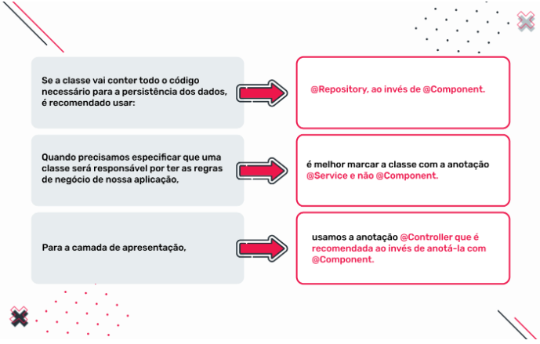

    Aula 24

# Estrutura de projetos em aplicações empresariais

Criando um projeto elejemos a representação de uma arquitetura multicamadas. Aqui estamos trabalhando com algumas das arquiteturas mais utilizadas nas empresas.

Cada camada deve ser incluída em um package específico. Cada um deles deve ter o mesmo nome de camada. Assim encontrar uma classe torna-se mais fácil e intuitivo. Mas haverão também dúvidas sobre onde localizar uma nova classe. Temos de observar que não existe um modelo único e dependendo do projeto teremos mais ou menos camadas.

#### O que é um POJO?

POJO ou Plain Old Java Object é um conceito que começou a ser usado com frameworks não intrusivos, como Spring e Hibernate. É uma instancia de classe que não estende nem implementa nada em especial.
- Não deve estender classes pré-especificadas;
- Não deve implementar classes pré-especificadas;
- Não deve ter anotações pré-especificadas;
- Não há restrição sobre o acesso ou modificação de seus atributos;
- Não é necessário incluir um construtor nele.
Sendo assim, se no seu programa você quer que uma classe represente uma entidade, você poderá criar um POJO da seguinte forma:

    public class Aluno {
        private String nome;
        private String sobrenome;
        
        public int idade;

        public String getNome() {
            return nome;
        }

        public void setNome(String nome) {
            this.nome = nome;
        }

        public String getSobrenome() {
            return sobrenome;
        }

        public void setSobrenome(String sobrenome) {
            this.sobrenome = sobrenome;
        }
    }

Nas aulas anteriores, vimos a mágica que o uso de @annotation fornece ao nosso código. Para continuar aprendendo como programamos uma aplicação em Java, precisamos conhecer um pouco mais sobre:

- @Component
- @Service
- @Repository

#### @Component

É uma anotação de nível de classe que indica que a classe com essa anotação é um componente ou Spring Bean. O Spring Framework detecta automaticamente as classes anotadas com @Component. Por exemplo:

    @Component
    public class SouUmComponente {
        // …
    }

Esta anotação quando possui uma situação mais específica podemos utilizar:

- @Repository
- @Service
- @Controller
Veremos algumas recomendações de uso:

#### @Service
A anotação @Service é usada para indicar que uma classe pertence à camada de negócio, ou seja, onde codificamos a lógica de negócio de nossa aplicação e ocultamos sua complexidade nas demais das camadas.

@Service é uma especialização de @Component, adicionando um valor semântico que indica a utilidade da classe anotada como @Service para a camada de negócio.

    @Service
    public class SouUmServico {
        // …
    }
    
#### @Repository
Com esta anotação estaremos definindo uma classe que implementará o padrão de repositório, que é responsável por armazenar os dados em um banco de dados.

    @Repository
    public class SouUmaClasseParaGuardarDados {
        // …
    }
    

Recomenda-se usar cada anotação alinhada ao seu propósito. Embora seja possível trocá-las, não é recomendado.

#### Injeção de dependências com Spring Boot

Como sabemos, se escrevem milhares de programas que disponibilizam ou consomem serviços web que se conectam a algum tipo de banco de dados. Isso significa muita repetição do mesmo código para realizar tarefas básicas com obter e armazenar informações, responder solicitações, etc.

No caso do **Spring Framework**, compilamos e escrevemos grande parte repetida do código em forma de bibliotecas. Mas usar esse código tornou-se difícil quando precisamos integrar as diferentes camadas de nosso sistema.

Por outro lado, o **Spring Boot** utiliza várias técnicas do Java para reduzir o que temos que fazer as coisas diferentes em nossa aplicação.

Injeção de dependência é a técnica pela qual um objeto fornece as dependências de outro objeto.

