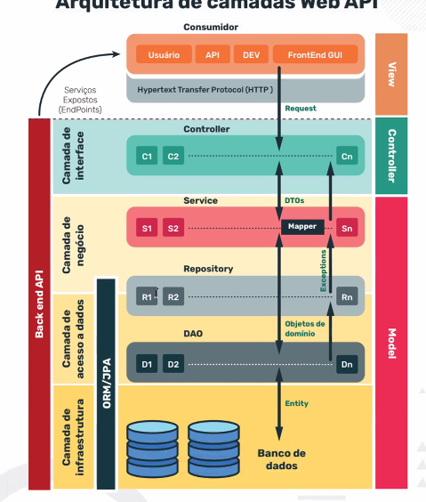

    Aula 26

#API REST

Com essa API os clientes agora recebem dados invés de receber as telas inteiras armazenadas no servidor.
O front-end é responsável por mostrar os dados traduzidos para o cliente ou servidor que receber os dados do servidor.

Os tipos de dados mais usados pelo API REST são JSON e XML
URL é o bairro da casa ex.: https://www.casasbahia.com.br
URN é o a rua da casa ex.: /telefones-e-celulares
Parâmetros é número da casa ex.: /b?filter=d%3A985424%3A985426
URI é o endereço completo ex.: https://www.casasbahia.com.br/telefones-e-celulares/b?filter=d%3A985424%3A985426

