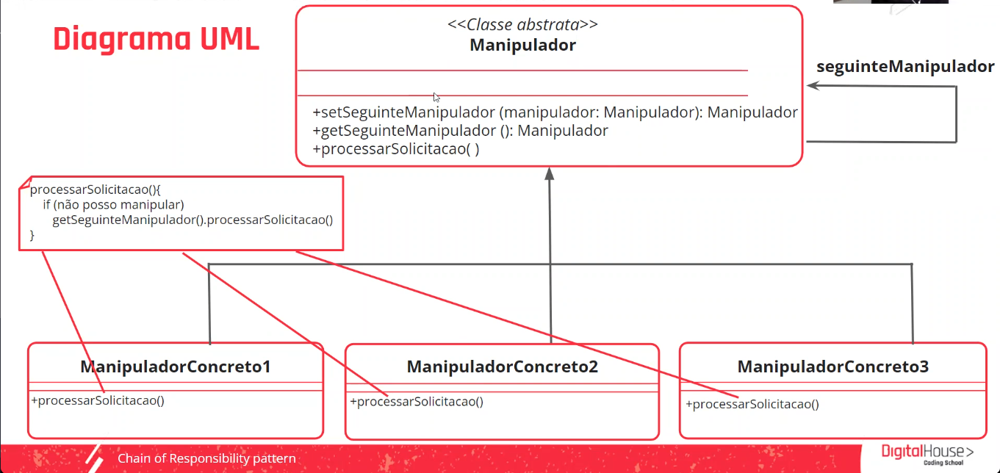

    Aula 4

## Chain of Responsibility pattern
 
É um corrente de responsabilidades em que uma classe chama a outra, uma instancia chama a outra, passando a responsabilidade.

|Propósito|Solução|
|-|-|
É um design pattern comportamental que permite que as solicitações passem por uma corrente de manipuladores. Ao receber uma solicitação, cada um deles decide se vai processá-la ou repassá-la ao próximo manupulador.| Criar uma corrente com as classes manipuladoras para processar a solicitação do cliente. Cada uma possui um campo para armazenar uma referência ao próximo manipulador na corrente. A solicitação viaja até que todos os manipuladores tenham a chande de processá-la (Os manipuladores podem decidir não aprovar a solicitação e interromper o procedimento).|

##### Diagrama UML do pattern **Chain of Responsability**

### Vantagens e desvantagens de usar esse design pattern

Vantagens|Desvantagens
|-|-|
|**Maior flexibilidade** para processar as solicitações dos clientes. É possível agregar objetos que saibam resolver novas responsabilidades ou modificar as atuais sem afear o cliente.| Pode ser complexo implementar a corrente e, se não for confiurada corretamente, todas as solicitações podem não ser atendidas.|
|**Menor acoplamento:** Permite que um objeto envie uma solicitação e saiba que ela será processada, mas tanto o remetente quanto o destinatário não sabem nada sobre o outro.||