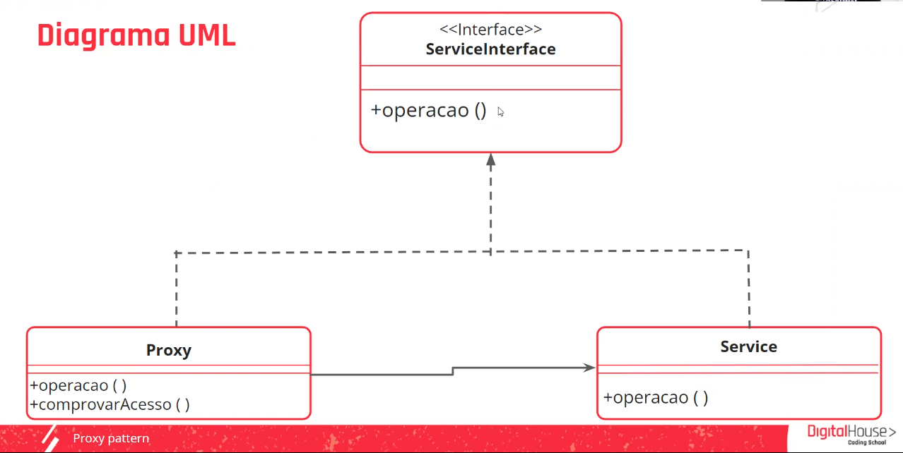

    Aula 5

## Proxy Pattern

O proxy funciona como se fosse o segurança da balada, ele que permite ou impede que conexões sejam feitas.
Ele valida ou não se você pode acessar determinado local na web e o cliente se comunica com o proxy invés de comunicar com o servidor de destino

|Propósito|Solução|
|-|-|
Seu objetivo é desenvolver a função de ser um intermediário que agrega funcionalidade a uma classe, sem tocar nela.|Definir uma classe Proxy com a mesma interface do objeto de serviço original. Posteriormente, nosso aplicativo deve ser atualizado para que os clientes se comuniquem com o proxy e não com o serviço de destino. Ao receber um pedido de um cliente, o proxy irá encamilhá-lo para o serviço, mas coo intermediário poderemos realizar operações antes ou depos de direcionar a solicitação.

##### Diagrama do Proxy Pattern

#### Vantagens e desvantagens
|Vantagens| Desvantagens|
|-|-|
O proxy funciona mesmo se o objeto de serviço não estiver pronto ou disponível.| Ao adicionar mais uma camada entre o cliente e o serviço real, a resposta pode ser atrasada.|
|*Princípio de aberto/fechado:* podemos introduzir novos proxies sem alterar o serviço ou clientes.|