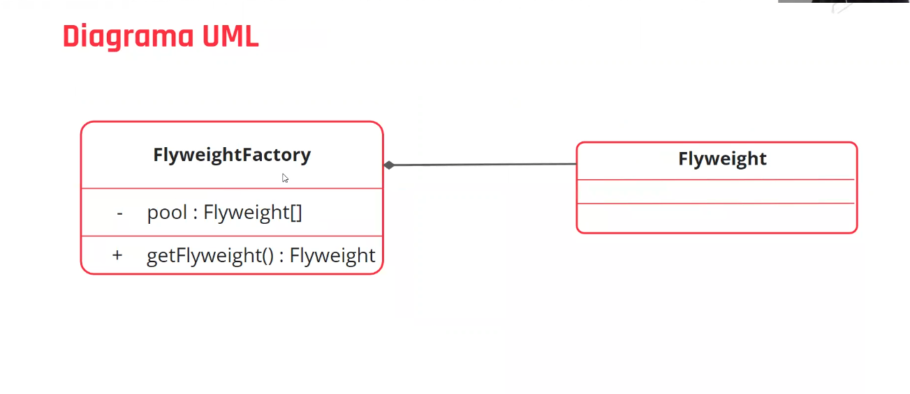

    Aula 6

## Flyweigh pattern

>> Vamos imaginar que temos no sistema, uma classe com poucos atributos, e que precisamos instanciar muitas vezes. o padrão flyweight nos permitirá ter menos instâncias e nos dará a habilidade de decorar.

Nesse padrão não é necessário criar muitas instancias em uma classe com poucos atributos, invés disso criamos um gerenciador para gerenciar as instancias e não precisarmos criá-las novamente, ocupando assim menos espaço na memória. Esse gerenciador é global, sendo assim, pode fazer com que uma classe D reutilize o que foi instanciado de uma classe A, se tiver os mesmos valores que ela precisa.

|Propósito|Solução|
|-|-|
O padrão compartilha partes do estado do objeto entre vários objetos. Logo, ele abstrai as partes reutilizáveis e, ao invés de criar objetos sempre que necessário, podemos reutilizar objetos criados por outras instâncias. Isso torna possível reduzir a capacidade de memória exigira pelo aplicativo.|Este padrão possui vários componentes: o cliente é o objeto que aciona a execução. A FlyweightFactory é a fábrica que usaremos para criar os objetos flyweight ou objetos leves. O flyweight corresponde aos objetos que queremos reutilziar para que sejam mais rápidos.|

#### Diagrama UML Flyweight Factory

#### Vantagens e desvantagens

|Vantagens| Desvantagens|
|-|-|
|Reduz bastante o peso dos dados no servidor.|Consome um pouco mais de tempo para realizar as buscas.|
