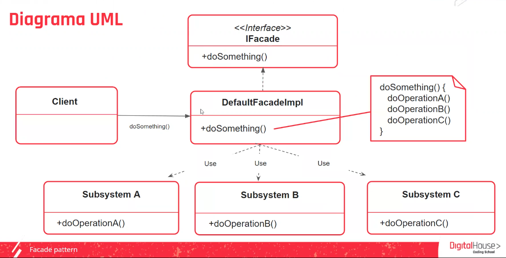

    aula 7

## Facade Pattern
>>Como reduzir a complexidade ao interagir com um conjunto de subsistemas, proporcionando um único ponto de entrada.
Exemplo do cotidiano: Invés de ir em vários lugares diferentes fazer compras de coisas diferentes, faz a entrada para fazer todas as compras em um lugar só pq o mercado que é responsável por ir atrás de todos os produtos.

|Propósito|Solução|
|-|-|
|Facade (Fachada) é um padrão de design estrutural que fornece uma interface simplificada para uma biblioteca, framework ou qualquer outro grupo complexo de classes.|Dispõe de uma interface que define como o cliente se comunicará com o sistema. Esta classe implementará esta interface para receber requisições e se encaregará de enviar a requisição do cliente para a classe correspondente (subsistemas)|

##### UML do Facade Pattern 

##### Vantagens e desvantagens
|Vantagens|Desvantagens|
|-|-|
|O software se torna mais flexível e fácil de expandir.||
|Reduzimos o uso de objetos que lidam diretamente com o cliente, tornando o sistema mais fácil de usar.|Alto grau de dependencia na interface da fachada (facade).|
|Reduzimos o acomplamento entre o cliente e os subsistemas, o que nos permite modificar os subsistemas sem afetar o cliente.||