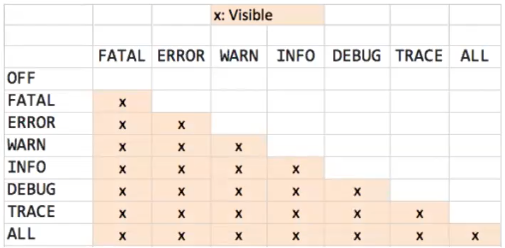

    aula 8

# Log4j

O log no Java funciona como o log no JS, serve para identificar os caminhos que estão sendo tomados pela aplicação

#### Caminho para importar o log4j para o projeto

//file > project structure > modules > dependencies > + > jar or directories

#### Criando logger no projeto

Precisa ser criado um file no package com o nome log4j.properties e inserir o código abaixo

    ##
    log4j.rootCategory=INFO, stdout
        
    log4j.appender.stdout=org.apache.log4j.ConsoleAppender
    log4j.appender.stdout.layout=org.apache.log4j.PatternLayout
    log4j.appender.stdout.layout.ConversionPattern=%-3d{dd-MM-yyyy HH:mm:ss} [%t] %-5p %c{1}:%L - %m%n

#### Criando arquivo com logger
    
    log4j.rootCategory=INFO,stdout,fileOut

    #### O segundo appender escreve em um arquivo e faz um backup ao #atingir o max
    
    log4j.appender.fileOut =org.apache.log4j.RollingFileAppender
    log4j.appender.fileOut.File=src/meulog.log
    
    ### Controla o tamanho maximo do arquivo
    log4j.appender.fileOut.MaxFileSize=100KB
    
    ### Faz backup dos arquivos de log (apenas 1)
    log4j.appender.fileOut.MaxBackupIndex=1
    log4j.appender.fileOut.layout=org.apache.log4j.PatternLayout
    
    #####este formato esta em ingles: 2011-04-24 e imprime o nro da #linha L#
    log4j.appender.fileOut.layout.ConversionPattern=%d [%t] %5p %c:%L - %m%n
    
    ####imprime no formato dia/mes/ano
    log4j.appender.fileOut.layout.ConversionPattern=%-2d{dd/MM/yyyy HH:mm:ss} [%t] %5p %c:%L - %m%n

A principal utilidade de salvar em arquivo é ter uma rastreabilidade maior.

##### Hierarquia do log4j
