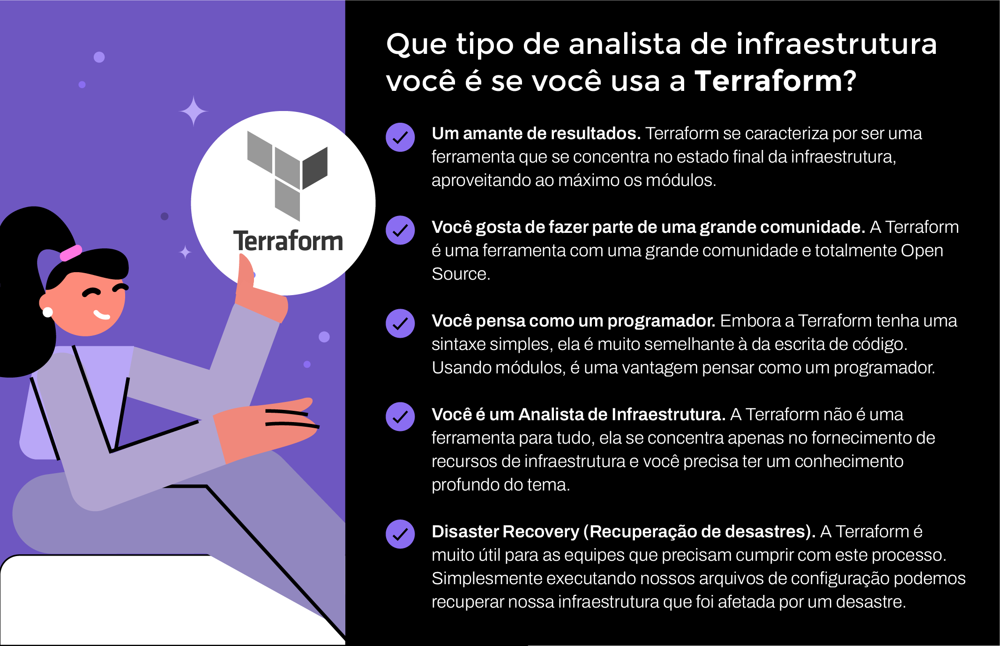

    Aula 8: Infraestrutura como código: Terraform

#### Três ferramentas: Terraform

Chegou a vez de aprender sobre Terraform

##### Do que se trata a Terraform?

É uma ferramenta open-source desenvolvida pela Hashi Corp, é a última IaC que será abordada nessa disciplina. Ela permite definir e abastecer a infraestrutura completa através de uma linguagem declarativa que pode ser executada como IaC.

Ela é similar à CloudFormation, mas tem a diferença de que não é só para AWS, mas pode ser usado também para outros fornecedores de infraestrutura cloud. E por ser declarativa, poermite escrever o código na linguagem de alto nível HCL(HashiCorp Configuration Language) para descrever o estado final desejado da sua infraestrutura. Essa ferramenta IaC é a mais utilizada pelas equipes de infraestrutura.

Com o Terraform podemos desenvolver um plano para atingir o estado final da infraestrutura e executar esse plano para entregar a infraestrutura.

###### Vantagens do Terraform:

- Velocidade devido a automatizações e código declarativo
- Confiança de escrever código com o estado final da infraestrutura em mente
- Menos erros, a possibilidade de cometer erros em grandes volumes de recursos para criar é bastante reduzida
- Fácilmente adaptável de um fornecedor de nuvem para outro
- Escalabilidade que ela nos oferece se a infraestrutura de ambiente de testes for aprovada pelas equipes de desenvolvimento é muito rápido empregar esses ou mais recursos em ambientes de desenvolvimento
- Idependencia de qualquer tipo de fornecedor de infraestrutura
- Possui módulos com recursos reutilizáveis para resolver problemas em comum e esses módulos tem módulos filhos que podem ser chamados para utilização em diferentes momentos

#### Como utilizá-la?

Nas outras ferramentas criamos um ambiente de desenvolvimento com instância EC2 em AWS. No Terraform isso também pode e será feito com um arquivo de configuração padrão da Terraform para criação de uma instância com todos os recursos necessários para um funcionamento totalmente automatizado.

###### No vídeo focamos em:

- A sintaxe dos arquivos de configuração.
- Como eles são executados
- A flexibilidade do código.
- O tipo de extensão dos arquivos.

[Documentação oficial do Terraform](https://registry.terraform.io/providers/hashicorp/aws/latest/docs)

###### Pontos fortes

#### Onde utilizá-la?

Algo importante na hora de compartilharmos nossa aplicação é através de onde compartilhamos. No seguinte guia, vamos criar uma máquina virtual com seu grupo de segurança e a rede hospedada dentro da Amazon Web Services, tudo isso com poucos comandos e três arquivos de configuração.

[Template-PDF-Terraform.pdf](Template-PDF-Terraform.pdf)

#### Quem a utiliza?

Terraform é uma ferramenta que se caracteriza pelo apoio da sua comunidade. Ainda, é uma ferramenta adaptável, pois pode ser utilizada em qualquer fornecedor de infraestrutura que utilizamos. Então, quem utiliza esta ferramenta? Como poderíamos identificar um usuário dela?

#### Exercitando

Vamos colocar em prática todo o aprendizado com a Terraform. Lembre-se que é fundamental que possamos corrigir os arquivos de nossos colegas de equipe. Neste caso, queremos publicar um site estático que é armazenado em um contentor, no serviço S3 da Amazon Web Services. Vamos lá!

[Template-erros-Terraform.pdf](Template-erros-Terraform.pdf)