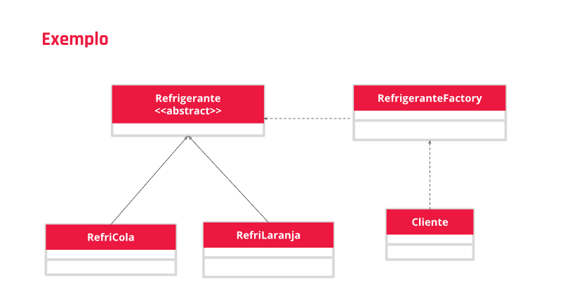

    Aula 19

## Padrão Factory

Cria objetos de uma forma mais genérica.
É um dos principais padrões de projeto e um dos mais utilizado nas linguagens de programação atuais. Ele tem duas variações:
- Factory Method
    - Define uma interface para criar objeto, mas permite que as subclasses decidam qual classe instanciar.
- Abstract Factory
    - Fornece interface para famílias de objetos dependentes ou relacionados, mas sem especificar suas classes concretas.

#### Factory Method

- Criador abstrato - declara o *factory method* que retorna o objeto da classe Product, este elemento também pode definir uma implementação básica que retorna um objeto de uma classe *ConcreteProduct* básica;
- ConcreteCreator - sobrescreve o factory method e retorna um objeto da classe *ConcreteProduct*;
- Product - define uma interface para os objetos criados pelo factory method;zx
- ConcreteProduct - uma implementação para a interface Product.

#### Abstract Method

- Fábrica abstrata - Tem o objetivo de declarar métodos de criação de objetos do tipo *ProdutoAbstrato*, que são implementados por uma classe do tipo *FabricaConcreta*, que estende ou implementa a *FabricaAbstrata*.
- Produto Abstrato - Declara os métodos que são implementados por classes do tipo *ProdutoConcreto*. *FabricaConcreta* cria internamente um objeto do tipo *ProdutoConcreto*, mas esse objeto é retornado como um *ProdutoAbstrato*.
- Fábrica Concreta - implementa os métodos declarados em *FabricaAbstrata* criando um objeto do tipo *ProdutoConcreto* e retornando-o como um *ProdutoAbstrato*.
- Produto concreto - Implementada os métodos declarados em *ProdutoAbstrato* essa é a classe que faz uma instancia concreta ser criada.

###### Conclusão: A proposta do padrão *Factory* é de criar objetos, por isso ele é considerado um padrão criacional. A lógica criacional é encapsulada dentro do factory e/ou é fornecido um método que retorna um novo objeto criado (Padrão Factory Method) ou é delegada a criação do objeto para a subclasse (Padrão Abstract Factory)

***
# Exemplo do padrão Factory Method

Implementação da Factory Method usando uma classe Refrigerante que distrubui diferentes tipos dependendo da implementação das suas subclasses.

**Código para classe abstrata Refrigerante**

    public abstract class Refrigerante{

        private String nome;

        public String getName(){
            return nome;
        }

        public void abrir (){
            System.out.println ("Você abrir uma lata de: " + getName());
        }
    }

**Código da classe Refrigerante Cola**

    public class RefriCola extends Refrigerante{

        public RefriCola(){
            setName("Koka Kola");
        }

        private void setName(String koka_kola) {
        }
    }

**Código da classe Refrigerante Laranja**

    public class RefriLaranja extends Refrigerante{

        public RefriLaranja(){
            setName("Laranja");
        }

        private void setName(String laranja) {
        }
    }

**Código da classe Refrigerante Factory**

    public class RefrigeranteFactory{

        public Refrigerante fazerRefrigerante(String tipo){

            Refrigerante regri = null;

            if(tipo.equals("K")){
            return new RefriCola();

        }else if(tipo.equals("L")){
            return new RefriLaranja();
        }else return null;
    }}