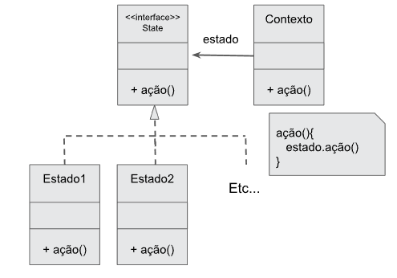

    Aula 21

# Padrão State

É a forma de fazer um objeto mudar de estado e permitindo que se mova de um estado para o outro.
Uma classe é implementada para cada estado do objeto e cada classe implementará os métodos responsáveis pelo comportamento que varia de acordo com o estado, assim sempre terá uma referência a um estado e se comunicará com ele para resolver suas responsabilidades. Por exemplo play, pause e stop seriam 3 estados diferentes.

|Vantagens|Desvantagens|
|-|-|
|As responsabilidades dos estados específicos são facilmente localizadas, pois estão nas classes que correspondem a cada estado. Isso fornece maior clareza no desenvolvimento e manutenção.| Dependendo da quantidade de estados sendo trabalhados em seu projeto, essa implementação do padrão State, apesar de simples, pode levar um tempo (que eventualmente será recompensado futuramente com um código limpo).
|Facilita a expansão de estados.|O número de subclasses é bem maior.|
|Torna as mudanças de estado explícitas à medida que cada estado é representado em uma classe. |
|Ele permite a um objeto que mude de classe em tempo de execução, pois ao mudar suas responsabilidades para as de outro objeto de outra classe, a herança e as responsabilidades do primeiro foram alteradas para as da segunda|

## Diagrama solução do padrão State 

- **Classe de contexto**: define a interface com o cliente. A instancia de contexto é aquela que define seu **estado atual**.
- **Interface State(estado)**: Interface para encapsular as responsabilidades associadas a um determinado estado de contexto. Defina as responsabilidades de cada estado.
- **Classe estado**: cada um implementa o comportamento ou responsabilidade do contexto.

## Como funciona?
O padrão não indica exatamente onde definir as transições de um estado pro outro, mas existem duas maneiras de fazer isso, que são:

1. Definindo essas transições **dentro da classe de contexto.**
2. Definindo essas transições **nas subclasses de State**

É mais conveniente utilizar a primeira solução quando o critério a ser aplicado for fixo, ou seja, não será modificado. O segundo é melhor aplicado quando esse critério for dinâmico, ele é apresetnado na dependência do código entre as subclasses.