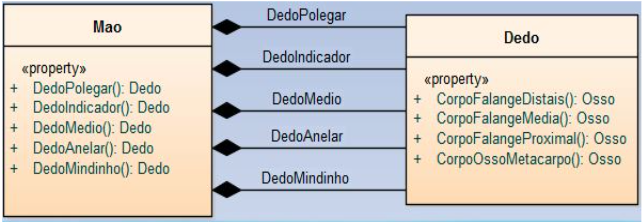
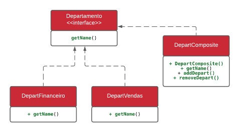

    Aula 22

# Padrão Composite

É um padrão estrutural e foca na forma que os objetos são compostos por outros objetos para formar estrtuturas maiores, tem estruturas de árvore para representar hierarquias do tipo todo-parte. O Composite dixa os clientes tratarem objetos individuais e composições de objetos do mesmo modo.

## Composição x Corpo Humano

- O corpo humano é um sistema.
- Como um software, podemos dizer que é composto por módulos, funcionalidades, requisitos funcionais e não funcionais, e regras de negócio.
- Do ponto de vista estrutural, assim como um software, podemos interpretá-lo como Pacores, composto de Classes, classes compostas por outras classes, todas com seus métodos, atributos e etc.
- Uma mão comum é composta por cinco dedos:
    - Polegar
    - Indicador
    - Médio
    - Anelar
    - Mindinho

**Pensando graficamente**

Baseado no exemplo a classe Mão é composta por vários objetos do tipo Dedo. Ou seja, a mão é composta por vários objetos, seguindo a ideia da hierarquia de classes que consiste de objetos primitovos

## Exemplo padrão Composite

#### UML:

**Implementação das classes exibidas no driagrama UML**

    public interface Departmento {
        public void getName();
    }

**Para os componentes folha, vamos definir classes para os departamentos financeiro e de vendas:**

    public class DepartFinanceiro implements Departamento {
        private int id;
        private String name;
            void getName(){
        System.out.println(getClass().getSimpleName());
        }
    }

**Para os componentes folha, vamos definir classes para os departamentos financeiro e de vendas:**

    public class DepartVendas implements Departamento {
        private int id;
        private String name;
            void getName(){
        System.out.println(getClass().getSimpleName());
        }
    }

Esta é uma classe composta, pois contém uma coleção de componentes do Departamento, bem como métodos para adicionar e remover elementos da lista.

O método composto getName() é implementado iterando sobre a lista de elementos folha e invocando o método apropriado para cada um.

    public class DepartComposite implements Departmento {
        private int id;
        private String name;

        private List<Departmento> childDepartments;

        public DepartComposite(int id, String name) {
            this.id = id;
            this.name = name;
            this.childDepartments = new ArrayList<>();
        }

        public void getName() {
            childDepartments.forEach(Departmento::getName);
        }

        public void addDepart(Departmento department) {
            childDepartments.add(department);
        }

        public void removeDepart(Departmento department) {
            childDepartments.remove(department);
        }
    }
