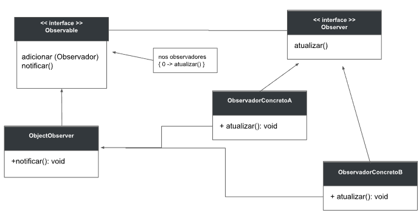

    Aula 24

# Padrão Observer

Um objeto pode ter outros objetos **dependentes** dele. Esses outros podem precisar ser **atualizados** com basse em uma mudança de estado no **objeto** do qual eles dependem. Ao tentar implementar essa lógica, muitas dificuldades aparecem.
O padrão **Observer** propõe que criando uma interface, quando um objeto muda de estado, todos os outros que dependem dele são notificados e atualizados **automaticamente**

## Definição

O *Padrão Observer* permite que um **objeto**, observado, **notifique automaticamente** todos os objetos vinculados a ele (objetos observadores) respeitando a relação um-pra-muitos. A notificação ocorre assim que o estado do objeto ovservado é atualizado.

|Vantagens|Desvantagens|
|-|-|
|Permite modificar os sujeitos e observadores de forma independente. É possível reutilizar objetos sem reutilizar seus observadores ou vice-versa. Isso adiciona escalabilidade, permitindo que observadores sejam adicionados sem modificar o assunto ou outros observadores.|Uma atualização aparentemente inofensiva sobre o assunto pode gerar uma série de atualizações em cascada dos observadores e seus objetos dependentes. Isso pode levar a atualizações falsas que são muito difíceis de localizar.|
|Ao contrário de uma solução comum, a notificação enviada por um assunto não precisa especificar seu destinatário. Isso gera um alcance a todos os observadores interessados.||
Graças ao fato de que sujeito e observador não estão fortemente acoplados, eles pode pertencer a diferentes camadas de abstração de um sistema.||

### UML do padrão observer:

- **Interface observable (assunto):** cada implementação (assunto) conhece seus observadores e pode ser observada por qualquer número de observadores. Ele também fornece uma interface para adicionar ou remover observadores.
- **Observer:** define uma interface para que cada implementação (Concrete Observer) possa atualizar os objetos que devem ser notificados de mudanças no assunto.
- **SpecificSubject:** Envie uma notificação aos seus observadores quando seu status mudar.
- **Observador concreto:** mantém uma referência a um objeto Assunto concreto. Salva um estado que deve ser consistente com o do Assunto. Implemente a interface de atualização do Observer para manter seu status em sincronia com o do assunto.

### Como funciona?

Quando o SubjectObservable passa por uma mudança de estado, o método "notificar ()" é executado, o qual percorre uma lista contendo todos os objetos que observam o SubjectObservable e chama seu método "atualizar()". Desta forma, todos os observadores ficam atualizados em caso de qualquer alteração, sem a necessidade de verificação constante de atualizações de status.

O padrão cria uma dependência direta de cada observador em relação ao assunto. Embora isso possa levar a complicações, é a maneira como o padrão é estruturado.

****

## Exemplo padrão observer

Agora, vamos imaginar uma implementação.

Suponha que temos um sistema que mostra o preço do ouro em um painel e que ao ser atualizado sincroniza com cada instância assinada informando a variação do preço.

**Criação da interface Observador**

    public interface Observador{
     String atualizar();
    }

**Criação da interface Observable**

    public interface Observable{
        void incluir(Observador o);
        void remover(Observador o);
        void notificar(String mudanca);

    }

**Código da classe Painel**

 
    public class Painel implements Observable{
        private float precoAtual();
        private ArrayList<Observador> observadores = new ArrayList<>();
        public void mudarPreco(float preco){
        this.precoAtual = preco;
        notificar(“ preço atualizado a ”+obterPreco());
        }
        public float obtrPreco(){return precoAtual;}
        } 
        @Override
        public void incluir(Observador o){
        this.observadores.add(o);
        }
        @Override
        public void remover(Observador o){
        this.observadores.remove(o);
        }
        @Override
        public void notificar(String mudanca){
        for(Observador o : observadores)
        System.out.print(o.atualizar() + mudanca);	
        }
    }

**Código da classe Ouro**

    public class Ouro implements Observador{
        @Override
        public String atualizar(){
        return this + “> Mudança de estado: ”;
        }

    }

**Classe Main**

    public class Main{
        public static void main(String[] args){
            Painel painel = new Painel();
            Observador obs1 = new Ouro();
        Observador obs1 = new Ouro();

        painel.incluir(obs1);
        painel.incluir(obs1);

        painel.mudarPreco(42.5f);
        painel.mudarPreco(44.3f);
        }
    }

